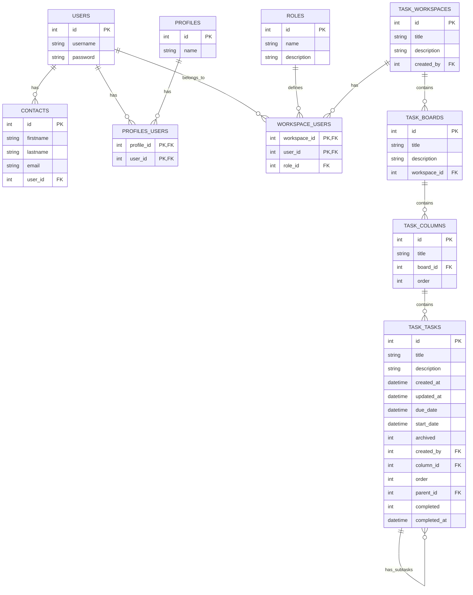

# SojaTask

SojaTask est une application de gestion de tâches collaborative inspirée de Trello. Elle permet aux équipes de :

- Organiser leurs tâches en tableaux et colonnes
- Suivre l'avancement des tâches avec des dates de début et d'échéance
- Collaborer au sein d'espaces de travail partagés
- Gérer les permissions des membres via un système de rôles

L'application est construite avec AdonisJS et React, utilisant Inertia.js pour créer une expérience monopage fluide.

## Schéma de Base de Données

### Description du Schéma

#### Gestion des Utilisateurs

- **USERS**: Comptes utilisateurs principaux avec détails d'authentification
- **CONTACTS**: Informations de contact associées aux utilisateurs
- **PROFILES**: Profils de rôles/permissions
- **PROFILES_USERS**: Table de jonction pour les associations utilisateurs-profils
- **ROLES**: Définition des rôles possibles dans les espaces de travail (ex: admin, membre, invité)
- **WORKSPACE_USERS**: Table de jonction pour associer les utilisateurs aux espaces de travail avec leur rôle

#### Relations

- Les utilisateurs peuvent avoir plusieurs contacts et profils
- Les utilisateurs peuvent appartenir à plusieurs espaces de travail avec des rôles différents
- Les rôles définissent les permissions des utilisateurs dans les espaces de travail
- Les espaces de travail contiennent plusieurs tableaux
- Les tableaux contiennent plusieurs colonnes
- Les colonnes contiennent plusieurs tâches
- Les tâches peuvent avoir des sous-tâches (relation auto-référentielle)
