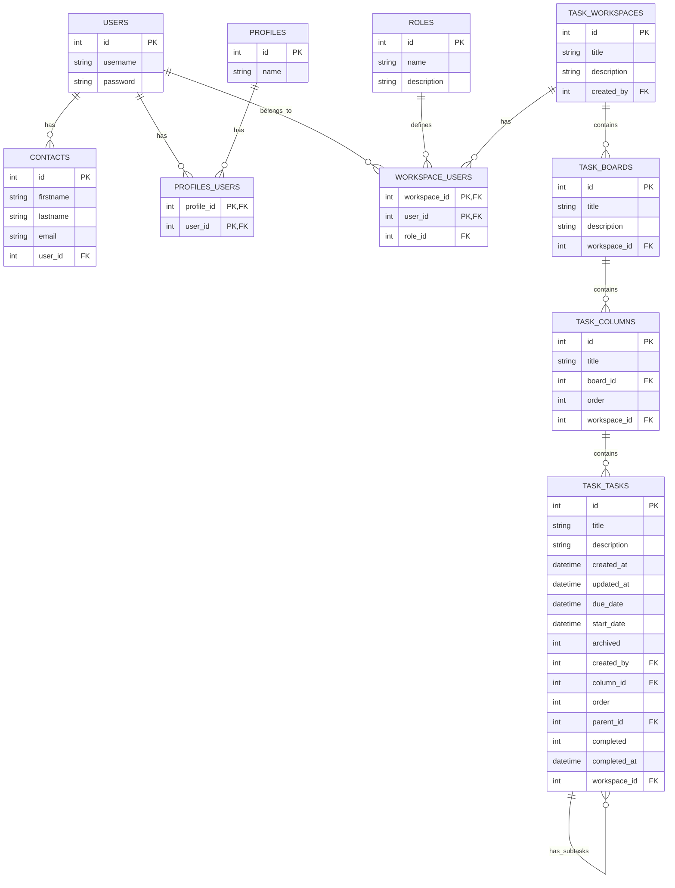
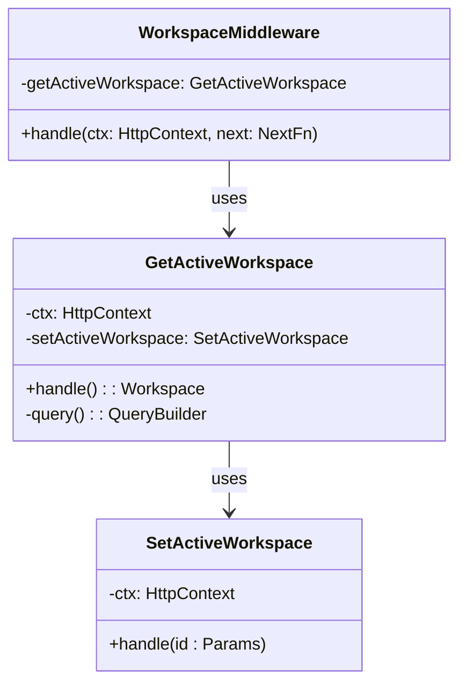
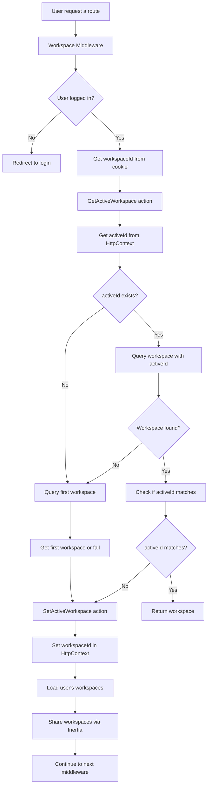

# SojaTask

SojaTask est une application de gestion de tâches collaborative inspirée de Trello. Elle permet aux équipes de :

- Organiser leurs tâches en tableaux et colonnes
- Suivre l'avancement des tâches avec des dates de début et d'échéance
- Collaborer au sein d'espaces de travail partagés
- Gérer les permissions des membres via un système de rôles

L'application est construite avec AdonisJS et React, utilisant Inertia.js pour créer une expérience monopage fluide.

## Schéma de Base de Données

### Description du Schéma

#### Gestion des Utilisateurs

- **USERS**: Comptes utilisateurs principaux avec détails d'authentification
- **CONTACTS**: Informations de contact associées aux utilisateurs
- **PROFILES**: Profils de rôles/permissions
- **PROFILES_USERS**: Table de jonction pour les associations utilisateurs-profils
- **ROLES**: Définition des rôles possibles dans les espaces de travail (ex: admin, membre, invité)
- **WORKSPACE_USERS**: Table de jonction pour associer les utilisateurs aux espaces de travail avec leur rôle

#### Gestion des Espaces de Travail

- **TASK_WORKSPACES**: Représente les espaces de travail où les utilisateurs collaborent.
- **TASK_BOARDS**: Contient plusieurs tableaux associés à un espace de travail.
- **TASK_COLUMNS**: Contient plusieurs colonnes dans chaque tableau, avec un ordre défini.
- **TASK_TASKS**: Contient les tâches, qui peuvent avoir des sous-tâches et sont associées à des colonnes.

#### Relations

- Les utilisateurs peuvent avoir plusieurs contacts et profils.
- Les utilisateurs peuvent appartenir à plusieurs espaces de travail avec des rôles différents.
- Les rôles définissent les permissions des utilisateurs dans les espaces de travail.
- Les espaces de travail contiennent plusieurs tableaux.
- Les tableaux contiennent plusieurs colonnes.
- Les colonnes contiennent plusieurs tâches.
- Les tâches peuvent avoir des sous-tâches (relation auto-référentielle).

### Multi-Tenancy

L'application utilise une architecture multi-locataire (multi-tenancy) pour permettre à plusieurs organisations d'utiliser la même instance de la base de données tout en maintenant leurs données séparées. Chaque table qui stocke des données liées aux tâches, colonnes et tableaux inclut un champ `workspace_id`. Cela permet de filtrer et de gérer les données en fonction de l'espace de travail, garantissant que les utilisateurs n'accèdent qu'à leurs propres données.

- **Exemple**: Lorsqu'une tâche est créée, elle est associée à un `workspace_id`, ce qui permet de s'assurer que seuls les utilisateurs de cet espace de travail peuvent voir et interagir avec cette tâche.

### Utilisation du Mixin `WithWorkspace`

Pour simplifier la gestion des relations avec les espaces de travail, nous avons créé un mixin appelé `WithWorkspace`. Ce mixin est utilisé dans les modèles `Board`, `Column` et `Task` pour ajouter automatiquement le champ `workspaceId` et la relation `belongsTo` avec le modèle `Workspace`.

- **Avantages**:
  - **Réduction de la Redondance**: En utilisant le mixin, nous évitons de répéter le code pour chaque modèle.
  - **Clarté**: Les modèles restent clairs et concis, tout en maintenant la logique de relation nécessaire.

### Convention de Nommage des Tables

Pour différencier les tables créées et liées à SojaTask des autres tables dans la base de données, un préfixe `task_` est utilisé. Cela permet de s'assurer que les tables de SojaTask ne se mélangent pas avec celles d'autres applications utilisant la même base de données.

---

## Gestion des Espaces de Travail

### Classes Principales

#### Diagramme de classe

#### 1. WorkspaceMiddleware

- **Purpose**: Gère le flux des requêtes liées aux espaces de travail, s'assurant que les utilisateurs ont accès à leur espace de travail actif.
- **Key Methods**:
  - `async handle(ctx: HttpContext, next: NextFn)`:
    - Vérifie si l'utilisateur est authentifié. Si non, redirige vers la page de connexion.
    - Récupère l'ID de l'espace de travail actif à partir des cookies et appelle `getActiveWorkspace.handle()` pour récupérer l'espace de travail actif.
    - Si aucun espace de travail n'est trouvé, redirige l'utilisateur vers la page de création d'espace de travail.
    - Charge tous les espaces de travail associés à l'utilisateur et les partage via Inertia pour utilisation dans le frontend.

#### 2. GetActiveWorkspace

- **Purpose**: Récupère l'espace de travail actif pour l'utilisateur authentifié.
- **Key Methods**:
  - `async handle()`:
    - Vérifie s'il y a un ID d'espace de travail actif dans le contexte.
    - Interroge la base de données pour l'espace de travail correspondant à l'ID actif. Si trouvé, le retourne.
    - Si aucun espace de travail n'est trouvé, récupère le premier espace de travail disponible.
    - Si l'ID d'espace de travail actif n'est pas défini ou ne correspond pas à l'espace de travail récupéré, appelle `setActiveWorkspace.handle()` pour définir le nouvel espace de travail actif.
  - `#query()`: Construit une requête pour récupérer les espaces de travail de l'utilisateur et précharge leurs tableaux associés.

#### 3. SetActiveWorkspace

- **Purpose**: Définit l'espace de travail actif pour l'utilisateur.
- **Key Methods**:
  - `async handle({ id }: Params)`:
    - Met à jour le contexte avec l'ID de l'espace de travail actif et définit un cookie pour persister cette information.

### Flowchart

---

## Liste de Contrôle d'Accès (ACL)

### Rôles
- **Admin** (ID de rôle : 3)
- **Membre** (ID de rôle : 2)
- **Invité** (ID de rôle : 1)

---

### Permissions pour les Espaces de Travail

| Permission                    | Admin | Membre | Invité |
| ----------------------------- | ----- | ------ | ------ |
| Modifier l'espace de travail  | ✅     | ✅      | ❌      |
| Supprimer l'espace de travail | ✅     | ❌      | ❌      |
| Inviter membres               | ✅     | ✅      | ❌      |
| Modifier le rôle des membres  | ✅     | ❌      | ❌      |
| Supprimer membres             | ✅     | ❌      | ❌      |
| Créer des tableaux            | ✅     | ✅      | ❌      |

---

### Permissions pour les Tableaux

| Permission               | Admin | Membre | Invité |
| ------------------------ | ----- | ------ | ------ |
| Modifier le tableau      | ✅     | ❌      | ❌      |
| Supprimer le tableau     | ✅     | ❌      | ❌      |
| Créer des colonnes       | ✅     | ✅      | ❌      |
| Réorganiser les colonnes | ✅     | ✅      | ❌      |
| Créer des tâches         | ✅     | ✅      | ❌      |
| Réorganiser les tâches   | ✅     | ✅      | ❌      |

---

### Permissions pour les Tâches

| Permission                                                   | Admin | Membre | Invité |
| ------------------------------------------------------------ | ----- | ------ | ------ |
| Ajouter/Supprimer des tags                                   | ✅  | ✅      | ❌      |
| Créer des sous-tâches                                        | ✅     | ✅      | ❌      |
| Marquer la tâche comme terminée (si validation non demandée) | ✅     | ✅      | ❌      |
| Marquer la tâche comme terminée (si validation demandée)     | ✅     | ❌      | ❌      |
| Assigner la tâche à un membre                                | ✅     | ❌      | ❌      |
| Supprimer la tâche                                           | ✅     | ❌      | ❌      |

---
